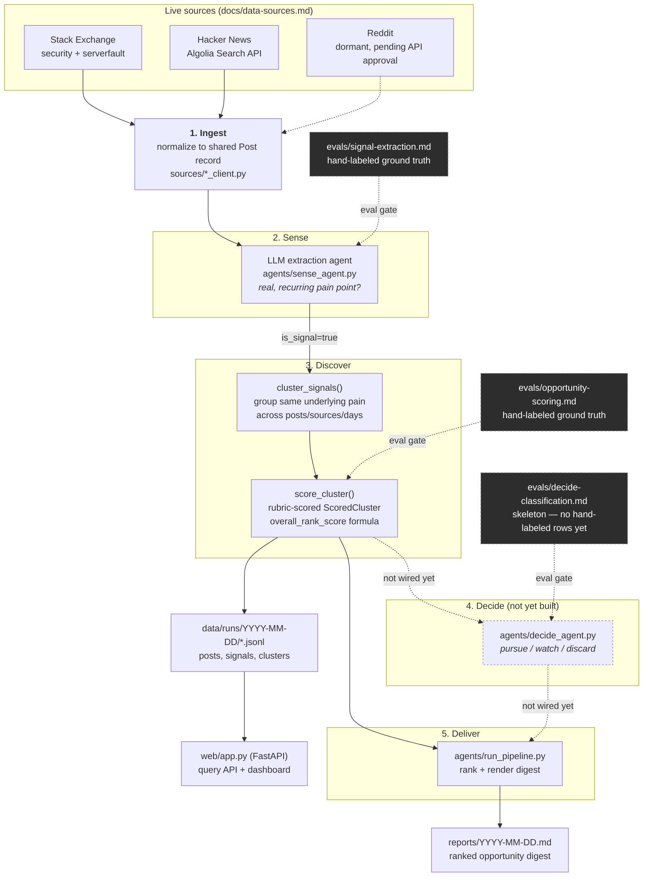

# Signal — Cybersecurity Opportunity-Sensing Agent

Signal turns public cybersecurity-practitioner complaints (Stack Exchange,
Hacker News) into scored, ranked market-opportunity candidates for a small
team. It's a scoped-down, extensible slice of the [Falkster 7-stage PM
Operating System](https://falkster.com/handbook/ai-agent-army) — just the
**Sense** and **Discover** stages, built on public data instead of the
enterprise data (Jira, Slack, Zendesk, Salesforce, Gong) the full system
assumes.

## What this project is actually about

The pipeline is not the point. This is a portfolio project built around a
genuinely rigorous, two-stage **eval framework built before any agent
logic**, in the ["the eval is the
spec"](https://falkster.com/handbook/the-eval-is-the-spec) discipline:
nothing gets built until the eval file for that stage exists with real,
hand-labeled ground truth — never synthetic or self-authored "ground truth."

- `evals/signal-extraction.md` — Sense-stage ground truth, hand-labeled from
  real pulled posts.
- `evals/opportunity-scoring.md` — Discover-stage ground truth, hand-scored
  from real extracted-and-clustered output.

Both are markdown tables doubling as the database of record — see
`docs/blogs/blog_post_5.md` ("Your eval file can be your database") for why.

## Pipeline



Each LLM stage is gated by its own eval file — the dashed lines above. No
agent prompt changes without checking (or updating) the eval it's scored
against first.

## Falkster-stage mapping

| Stage | In this project | Status |
|---|---|---|
| Sense | Ingestion + pain-signal extraction agent | v1, eval-passing |
| Discover | Clustering + opportunity scoring agent | v1, accepted with known gaps |
| Decide | Pursue/watch/discard classification agent | eval skeleton only (`evals/decide-classification.md`) — no agent yet |
| Build / Ship / Measure / Amplify | Would need real product data this project doesn't have | roadmap only |

The full Falkster fleet assumes enterprise data this project doesn't have
access to — everything past Discover is an honest, stated roadmap item, not
something quietly skipped.

## Eval results (current)

**Sense-stage** (`evals/signal-extraction.md`, `evals/run_evals.py`):

| Metric | Result | Bar |
|---|---|---|
| `is_signal` accuracy | 89.7% (26/29) | ≥ 90% |
| False positives on noise rows | 0 | 0 |
| Adversarial cases | 5/6 covered | — |

Accepted as passing in spirit: the 3 misses land exactly on the rows the
human labeler had already flagged as lowest-confidence during labeling, not
on clear-cut signal — read as the eval correctly surfacing genuine boundary
cases rather than a prompt defect.

**Discover-stage** (`evals/opportunity-scoring.md`,
`evals/run_discover_scoring_eval.py`), last full run against live
re-extraction:

| Field | MAE | Notes |
|---|---|---|
| `small_team_feasibility` | 0.031 | deterministic formula over an LLM-classified tier |
| `willingness_to_pay_signal` | 0.038 | deterministic formula over an LLM-classified tier |
| `frequency_corroboration` | 0.000 | pure formula, no LLM |
| `overall_rank_score` | 0.060 | deterministic formula; 4/16 exact rank-position agreement |
| `signal_validity` / `extraction_accuracy` | ~0.06–0.11 | direct LLM output, not tuned this pass |
| `novelty` | ~0.15–0.19 | intentionally never tuned tight — rubric requires human review, not LLM self-certification |

Accepted with known open gaps (see `docs/progress.md` for the full
calibration history): only 16 hand-labeled clusters exist and every pass so
far has been validated against that same set, with no held-out test data
yet.

## Repo structure

```
/docs/                          # architecture, data sources, progress log
/evals/
  signal-extraction.md          # Eval Set 1 — Sense-stage ground truth
  opportunity-scoring.md        # Eval Set 2 — Discover-stage ground truth
  run_evals.py                  # scores sense_agent.py against Eval Set 1
  run_discover_scoring_eval.py  # scores discover_agent.py against Eval Set 2
/sources/
  stackexchange_client.py       # primary live source
  hn_client.py                  # secondary live source
  models.py                     # shared post record
  reddit_client.py              # not yet built — dormant, pending Reddit API approval
/agents/
  sense_agent.py                # Sense-stage extraction
  discover_agent.py              # Discover-stage clustering + scoring
  run_pipeline.py                # full daily run: ingest -> Sense -> Discover -> digest
/data/runs/YYYY-MM-DD/          # raw posts, signals, scored clusters (JSONL) — gitignored
/reports/                       # generated daily digests — gitignored, not committed
/web/
  app.py                        # FastAPI query API + server-rendered dashboard
  store.py                      # loads/filters data/runs/*/clusters.jsonl (no DB yet)
  templates/index.html          # dashboard view (Jinja2)
```

## Running it

```
pip install -r requirements.txt
cp .env.example .env   # fill in ANTHROPIC_API_KEY (required); STACKEXCHANGE_KEY is optional
python agents/run_pipeline.py
```

This pulls a real batch from Stack Exchange and Hacker News, runs both LLM
stages, and writes a ranked digest to `reports/<date>.md` plus raw
posts/signals/clusters to `data/runs/<date>/*.jsonl`. It makes real Anthropic
API calls and Stack Exchange/HN requests — expect it to take several minutes.

To check either stage against its eval instead of running the full pipeline:

```
python evals/run_evals.py                     # Sense-stage
python evals/run_discover_scoring_eval.py      # Discover-stage
```

To browse and filter every run's scored clusters — a dashboard plus a JSON
API, both reading directly off `data/runs/*/clusters.jsonl`, no database:

```
uvicorn web.app:app --reload
```

Then open `http://127.0.0.1:8000/` for the dashboard (filter by date range,
minimum `overall_rank_score`, or keyword), or query `GET /api/clusters` /
`GET /api/runs` directly.

## What's not built yet

- **Decide-stage agent** (`agents/decide_agent.py`) — next up. The eval file
  (`evals/decide-classification.md`) is scaffolded with a target schema, a
  draft rubric, and 21 real candidate rows pulled from an actual pipeline
  run, but every `decide_action` is still a `PENDING` placeholder — no
  hand-labeling done yet, so no agent code gets written per the project's
  eval-first discipline.
- **A held-out eval set** — all Discover-stage calibration has been checked
  against the same 16 hand-labeled clusters it was tuned on.
- **Cybersecurity-vs-general-ops scope filtering** — the eval file's human
  labeler prunes off-mission ops/reliability clusters (e.g. backup tooling,
  VPN architecture) by hand; the live pipeline has no equivalent filter, so
  those clusters do appear in real digests. Documented as a known,
  deliberately-accepted gap in `docs/progress.md` — possibly something
  Decide-stage classification ends up enforcing instead.
- **Railway deployment** — hosting the existing `web/` app on Railway with a
  managed Postgres backend and a scheduled worker running the pipeline
  daily; not started, and deliberately sequenced after Decide lands rather
  than before (nothing runs on a schedule today, so there's no cost to
  waiting — see `docs/progress.md`). Local JSONL storage is the intended
  stopgap until then, per project convention.

See `docs/progress.md` for the full status snapshot and calibration history,
and `docs/architecture.md` / `docs/data-sources.md` for the underlying design
decisions.
